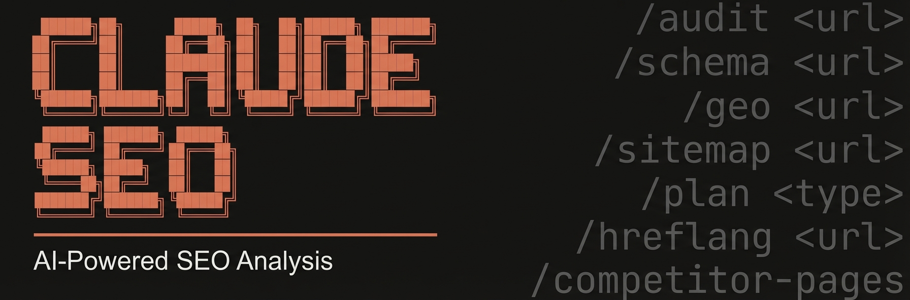
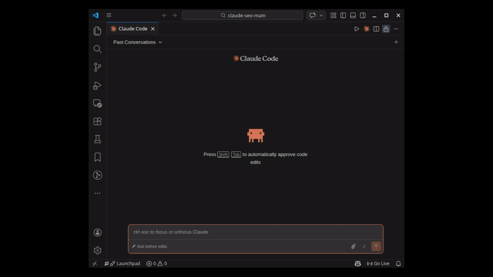

<!-- Updated: 2026-04-14 -->



# Claude SEO - SEO Audit Skill for Claude Code

Comprehensive SEO analysis skill for Claude Code. Covers technical SEO, on-page analysis, content quality (E-E-A-T), schema markup, image optimization, sitemap architecture, AI search optimization (GEO), local SEO, maps intelligence, Google SEO APIs (Search Console, PageSpeed, CrUX, GA4), PDF report generation, and strategic planning.



[](https://claude.ai/claude-code)
[](LICENSE)

## Table of Contents

- [Installation](#installation)
- [Quick Start](#quick-start)
- [Commands](#commands)
- [Features](#features)
- [Architecture](#architecture)
- [Extensions](#extensions)
- [Ecosystem](#ecosystem)
- [Documentation](#documentation)
- [Requirements](#requirements)
- [Uninstall](#uninstall)
- [Contributing](#contributing)

## Installation

### Manual Install (Unix/macOS/Linux)

```bash
git clone --depth 1 https://github.com/shantanu11/claude-seo-CK.git
bash claude-seo-CK/install.sh
```

### Windows (PowerShell)

```powershell
git clone --depth 1 https://github.com/shantanu11/claude-seo-CK.git
powershell -ExecutionPolicy Bypass -File claude-seo-CK\install.ps1
```

## Quick Start

```bash
# Start Claude Code
claude

# Run a full site audit
/seo audit https://example.com

# Analyze a single page
/seo page https://example.com/about

# Check schema markup
/seo schema https://example.com

# Generate a sitemap
/seo sitemap generate

# Optimize for AI search
/seo geo https://example.com
```


## Commands

| Command | Description |
|---------|-------------|
| `/seo audit <url>` | Full website audit with parallel subagent delegation |
| `/seo page <url(s)>` | Page analysis -- 1 URL (detailed) or multiple URLs (auto batch with page/content/geo modes) |
| `/seo sitemap <url>` | Analyze existing XML sitemap |
| `/seo sitemap generate` | Generate new sitemap with industry templates |
| `/seo schema <url>` | Detect, validate, and generate Schema.org markup |
| `/seo images <url>` | Image optimization analysis |
| `/seo technical <url>` | Technical SEO audit (9 categories) |
| `/seo content <url>` | E-E-A-T and content quality analysis |
| `/seo geo <url>` | AI Overviews / Generative Engine Optimization |
| `/seo plan <type>` | Strategic SEO planning (saas, local, ecommerce, publisher, agency) |
| `/seo programmatic <url>` | Programmatic SEO analysis and planning |
| `/seo competitor-pages <url>` | Competitor comparison page generation |
| `/seo local <url>` | Local SEO analysis (GBP, citations, reviews, map pack) |
| `/seo maps [command]` | Maps intelligence (geo-grid, GBP audit, reviews, competitors) |
| `/seo hreflang <url>` | Hreflang/i18n SEO audit and generation |
| `/seo google [command] [url]` | Google SEO APIs (GSC, PageSpeed, CrUX, Indexing, GA4) |
| `/seo google report [type]` | Generate PDF/DOCX/XLSX report with charts (cwv-audit, gsc-performance, indexation, full) |
| `/seo google inspect-urls <urls>` | Batch URL Inspection from comma-separated list (50+ URLs, concurrent workers) |
| `/seo report --input <file>` | Convert any analysis output (md/json) to shareable DOCX/PDF |
| `/seo backlinks <url>` | Backlink profile analysis (free: Moz, Bing, Common Crawl) |
| `/seo firecrawl [command] <url>` | Full-site crawling and site mapping (extension) |
| `/seo dataforseo [command]` | Live SEO data via DataForSEO (extension) |
| `/seo image-gen [use-case] <desc>` | AI image generation for SEO assets (extension) |

### `/seo programmatic [url|plan]`
**Programmatic SEO Analysis & Planning**

Build SEO pages at scale from data sources with quality safeguards.

**Capabilities:**
- Analyze existing programmatic pages for thin content and cannibalization
- Plan URL patterns and template structures for data-driven pages
- Internal linking automation between generated pages
- Canonical strategy and index bloat prevention
- Quality gates: WARNING at 100+ pages, HARD STOP at 500+ without audit

### `/seo competitor-pages [url|generate]`
**Competitor Comparison Page Generator**

Create high-converting "X vs Y" and "alternatives to X" pages.

**Capabilities:**
- Structured comparison tables with feature matrices
- Product schema markup with AggregateRating
- Conversion-optimized layouts with CTA placement
- Keyword targeting for comparison intent queries
- Fairness guidelines for accurate competitor representation

### `/seo hreflang [url]`
**Hreflang / i18n SEO Audit & Generation**

Validate and generate hreflang tags for multi-language sites.

**Capabilities:**
- Generate hreflang tags (HTML, HTTP headers, or XML sitemap)
- Validate self-referencing tags, return tags, x-default
- Detect common mistakes (missing returns, invalid codes, HTTP/HTTPS mismatch)
- Cross-domain hreflang support
- Language/region code validation (ISO 639-1 + ISO 3166-1)

## Features

### Core Web Vitals (Current Metrics)
- **LCP** (Largest Contentful Paint): Target < 2.5s
- **INP** (Interaction to Next Paint): Target < 200ms
- **CLS** (Cumulative Layout Shift): Target < 0.1

> Note: INP replaced FID on March 12, 2024. FID was fully removed from all Chrome tools on September 9, 2024.

### E-E-A-T Analysis
Updated to September 2025 Quality Rater Guidelines:
- **Experience**: First-hand knowledge signals
- **Expertise**: Author credentials and depth
- **Authoritativeness**: Industry recognition
- **Trustworthiness**: Contact info, security, transparency

### Schema Markup
- Detection: JSON-LD (preferred), Microdata, RDFa
- Validation against Google's supported types
- Generation with templates
- Deprecation awareness:
  - HowTo: Deprecated (Sept 2023)
  - FAQ: Restricted to gov/health sites (Aug 2023)
  - SpecialAnnouncement: Deprecated (July 2025)

### AI Search Optimization (GEO)
New for 2026 - optimize for:
- Google AI Overviews
- ChatGPT web search
- Perplexity
- Other AI-powered search

### Google SEO APIs (New in v1.7.0)
Direct integration with Google's SEO data:
- **PageSpeed Insights + CrUX**: Lab and field Core Web Vitals data
- **Search Console**: Top queries, URL inspection, sitemap status
- **Indexing API**: Notify Google of new/updated/removed URLs
- **GA4**: Organic traffic, top landing pages, device/country breakdown
- **Reports**: Enterprise reports in PDF, DOCX, XLSX, and HTML with charts via WeasyPrint + matplotlib + python-docx
- **Batch URL Inspection**: Inspect 50+ URLs at once with concurrent workers, progress tracking, and incremental save

4-tier credential system — get value at every level:
| Tier | Auth | APIs |
|------|------|------|
| 0 | API key | PSI, CrUX, CrUX History |
| 1 | + OAuth/SA | + GSC, URL Inspection, Indexing |
| 2 | + GA4 config | + GA4 organic traffic |
| 3 | + Ads token | + Keyword Planner |

### Local SEO & Maps Intelligence (New in v1.6.0)
- Google Business Profile optimization
- NAP consistency auditing
- Citation and review analysis
- Geo-grid rank tracking and competitor radius mapping

### Quality Gates
- Warning at 30+ location pages
- Hard stop at 50+ location pages
- Thin content detection per page type
- Doorway page prevention

## Architecture

```
~/.claude/skills/seo/         # Main orchestrator skill
~/.claude/skills/seo-*/       # Sub-skills (16 + 3 extensions)
~/.claude/agents/seo-*.md     # Subagents (11 + 2 extensions)
```

### Video & Live Schema (New)
Additional schema types for video content, live streaming, and key moments:
- VideoObject: Video page markup with thumbnails, duration, upload date
- BroadcastEvent: LIVE badge support for live streaming content
- Clip: Key moments / chapters within videos
- SeekToAction: Enable seek functionality in video rich results
- SoftwareSourceCode: Open source and code repository pages

See `schema/templates.json` for ready-to-use JSON-LD snippets.

### Report Formats

Generate professional reports after any analysis:

```bash
/seo google report full                     # PDF (default)
/seo google report full --format docx       # Word document
/seo google report full --format xlsx       # Excel spreadsheet
/seo google report full --format all        # All formats
```

| Format | Description | Dependency |
|--------|-------------|------------|
| **PDF** | A4 report with charts, TOC, executive summary | `weasyprint` |
| **DOCX** | Word document with branded styles, tables, embedded charts | `python-docx` |
| **XLSX** | Excel workbook with filterable data sheets | `openpyxl` |
| **HTML** | Standalone HTML file | (built-in) |

### Batch Page/Content/GEO Analysis (50+ URLs)

Analyze multiple pages at once with four modes:

```bash
# On-page SEO (title, meta, headings, links, schema)
/seo page-batch --urls "url1,url2,url3..." --mode page

# Content / E-E-A-T (readability, author, dates, citations)
/seo page-batch --batch urls.txt --mode content --workers 5

# GEO / AI citation readiness (citability, Q&A, answer-first)
/seo page-batch --batch urls.txt --mode geo --workers 5

# Everything combined
/seo page-batch --batch urls.txt --mode all --workers 5
```

Auto-saves results with domain-based filename and prints the exact report command:

```
Results saved to: seo-batch-cashkaro.com-all-20260414-1545.json
Generate DOCX report: /seo report --input seo-batch-cashkaro.com-all-20260414-1545.json --format docx
```

### Batch URL Inspection (50+ URLs)

Inspect indexation status for large URL lists:

```bash
/seo google inspect-batch urls.txt --workers 5
/seo google inspect-urls "https://a.com/1,https://a.com/2,..."
```

Features: shared service object, 1-10 concurrent workers, progress with ETA, incremental JSON save. Limit: 2,000 URLs/day per site.

### Universal Report Generator

Convert any analysis output to a shareable DOCX or PDF -- no re-analysis needed:

```bash
# From batch analysis JSON
/seo report --input seo-batch-cashkaro.com-all-20260414-1545.json --format docx

# From audit markdown
/seo report --input FULL-AUDIT-REPORT.md --input ACTION-PLAN.md --format docx

# Auto-find all reports in current directory
/seo report --dir ./ --format both
```

Accepts: `.md` reports from any `/seo` command, `.json` from `page-batch` or Google APIs.
Outputs: Professional DOCX (branded tables, headings) or PDF (styled HTML).

### Recently Added
- **Batch page/content/geo analysis** -- `/seo page-batch` with `--mode page|content|geo|all` for 50+ URLs
- **Universal report generator** -- `/seo report` converts any analysis output to shareable DOCX/PDF
- **DOCX report format** -- Word document output for all report types (`--format docx`)
- **Batch URL Inspection enhancements** -- `--urls` direct input, `--workers` concurrency, progress tracking
- Programmatic SEO skill (`/seo programmatic`)
- Competitor comparison pages skill (`/seo competitor-pages`)
- Multi-language hreflang validation (`/seo hreflang`)
- Video & Live schema types (VideoObject, BroadcastEvent, Clip, SeekToAction)

## Requirements

- Python 3.10+
- Claude Code CLI
- Optional: Playwright for screenshots
- Optional: Google API credentials for enriched data (see `/seo google setup`)

## Uninstall

```bash
git clone --depth 1 https://github.com/shantanu11/claude-seo-CK.git
bash claude-seo-CK/uninstall.sh
```

### MCP Integrations

Integrates with MCP servers for live SEO data, including official servers from **Ahrefs** (`@ahrefs/mcp`) and **Semrush**, plus community servers for Google Search Console, PageSpeed Insights, and DataForSEO. See [MCP Integration Guide](docs/MCP-INTEGRATION.md) for setup.

## Extensions

Optional add-ons that integrate external data sources via MCP servers.

### DataForSEO

Live SERP data, keyword research, backlinks, on-page analysis, content analysis, business listings, AI visibility checking, and LLM mention tracking. 22 commands across 9 API modules.

```bash
# Install (requires DataForSEO account)
./extensions/dataforseo/install.sh
```

```bash
# Example commands
/seo dataforseo serp best coffee shops
/seo dataforseo keywords seo tools
/seo dataforseo backlinks example.com
/seo dataforseo ai-mentions your brand
/seo dataforseo ai-scrape your brand name
```

See [DataForSEO Extension](extensions/dataforseo/README.md) for full documentation.

### Banana (AI Image Generation)

Generate SEO images (OG previews, blog heroes, product photos, infographics) using the
Claude Banana Creative Director pipeline.

```bash
# Install extension
./extensions/banana/install.sh
```

```bash
# Example commands
/seo image-gen og "Professional SaaS dashboard"
/seo image-gen hero "AI-powered content creation"
/seo image-gen batch "Product photography" 3
```

See [Banana Extension](extensions/banana/README.md) for full documentation.
Already using standalone Claude Banana? The extension reuses your existing nanobanana-mcp setup.

### Firecrawl (Site Crawling)

Full-site crawling and URL discovery using the [Firecrawl](https://www.firecrawl.dev/) MCP server.

```bash
# Install extension
./extensions/firecrawl/install.sh
```

```bash
# Example commands
/seo firecrawl crawl https://example.com
/seo firecrawl map https://example.com
```

See [Firecrawl Extension](extensions/firecrawl/README.md) for full documentation.

## Ecosystem

Claude SEO is part of a family of Claude Code skills that work together:

| Skill | What it does | How it connects |
|-------|-------------|-----------------|
| Claude SEO | SEO analysis, audits, schema, GEO | Core -- analyzes sites, generates action plans |
| Claude Blog | Blog writing, optimization, scoring | Companion -- write content optimized by SEO findings |
| Claude Banana | AI image generation via Gemini | Shared -- generates images for SEO assets and blog posts |

**Workflow example:**
1. `/seo audit https://example.com` -- identify content gaps and technical issues
2. `/seo backlinks https://example.com` -- analyze link profile and competitor gaps
3. `/blog write "target keyword"` -- create SEO-optimized blog posts
4. `/seo image-gen hero "blog topic"` -- generate hero images (banana extension)
5. `/seo geo https://example.com/blog/post` -- optimize for AI citations

## Documentation

- [Installation Guide](docs/INSTALLATION.md)
- [Commands Reference](docs/COMMANDS.md)
- [Architecture](docs/ARCHITECTURE.md)
- [MCP Integration](docs/MCP-INTEGRATION.md)
- [Troubleshooting](docs/TROUBLESHOOTING.md)

## License

MIT License - see [LICENSE](LICENSE) for details.

## Contributing

Contributions welcome! Please read [CONTRIBUTING.md](CONTRIBUTING.md) before submitting PRs.

---

Built for Claude Code by [@shantanu11](https://github.com/shantanu11)
